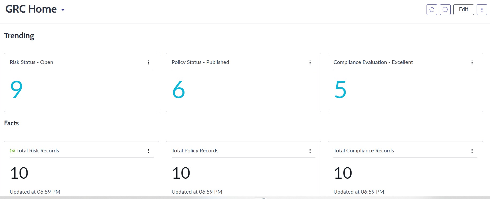

# Scalable and Efficient GRC Framework for Cybersecurity

## Overview
This project demonstrates the design, development, and implementation of a scalable Governance, Risk, and Compliance (GRC) framework using the [ServiceNow Developer Platform](https://developer.servicenow.com/dev.do). The solution enhances compliance, risk management, and governance in an organizational setting, leveraging structured tables, forms, dashboards, and automation workflows.

---

## Key Features
1. **Comprehensive Data Structure**: 
   - Asset, Policy, Risk, Control, Compliance, and Audit tables.
   - Lookup tables for streamlined operations and categorization.

2. **Custom Workspaces**:
    - User-friendly forms for data input and management.
    - Visual widgets for intuitive and real-time insights.

3. **Dashboards**:
    - **Risk Dashboard**: Displays analytics related to identified risks and mitigation efforts.
    - **Policy Dashboard**: Monitors policy management and version history.
    - **Compliance Dashboard**: Provides a snapshot of organizational compliance status.

4. **Automation**:
- Automated workflows for:
    - **Risk level computation**: Evaluates risks dynamically.
    - **Policy version control**: Manages versioning and tracks updates.
    - **Compliance evaluation**: Determines compliance levels based on scores.
    - **Notifications**: Alerts users about policy status changes and updates.

---

## ServiceNow Tools Used:
- [**App Engine Studio**](https://www.servicenow.com/products/app-engine-studio.html): Enables business growth through a low-code, visual app environment, streamlining application development.

- [**Workflow Studio**](https://www.servicenow.com/docs/bundle/xanadu-build-workflows/page/administer/workflow-studio/reference/workflow-studio.html): A unified platform for creating, configuring, and monitoring workflows, providing a streamlined single-page experience. Facilitates the automation of intricate workflows with ease.

- [**UI Builder**](https://www.servicenow.com/docs/bundle/xanadu-application-development/page/administer/ui-builder/concept/ui-builder-overview.html): A web-based tool for creating user interfaces, enabling the design of intuitive pages for App Engine Studio-generated workspaces and custom workspaces.

---

## Data Structure

### Primary Tables

#### Asset Table:
Tracks organizational assets and their associated critical details  such as ownership, criticality, and business impact.

- **Attributes**: Asset_ID, Asset_Type_ID, Owner_ID, Department, Criticality, Business_Impact, Violation_Details

    

#### Policy Table:
Manages policies and their lifecycle including versions, approval statuses, and updates.

- **Attributes**: Policy_ID, Policy_Name, Description, Version, Created_Date, Owner_ID, Approval_Status, Current approval status, Last_Updated

    

#### Risk Table:
Evaluates risks using attributes like likelihood, and impact as well as links them to assets and mitigation controls.

- **Attributes**: Risk_ID, Risk_Category_ID, Risk_Description, Likelihood, Impact, Risk_Score, Risk_Level, Linked_Asset_ID, Mitigation_Control_ID, Risk_Status_ID, Impact_Details

    

#### Control Table:
Defines control measures and evaluates their effectiveness.

- **Attributes**: Control_ID, Control_Name, Control_Description, Control_Type, Control_Effectiveness 

    

#### Compliance Table:
Aligns with regulations and monitors compliance scores.

- **Attributes**: Compliance_ID, Regulation_ID, Descriptions, Assessment_Method, Related_Risks_ID, Audit_Reference_ID, Compliance_Score, Compliance_Evaluation, Last_Evaluation

    

#### Audit Table:
Tracks audit activities, findings, and corrective actions.

- **Attributes**: Audit_ID, Audit_Date, Audit_Type, Auditor_ID, Audit_Status_ID, Findings, Corrective_Actions

    

### Lookup Tables
Lookup tables provide streamlined categorization for consistent operations.

- **Status Lookup**: Workflow statuses for policies, risks, and audits.
- **Audit Type Lookup**: Predefined audit types (e.g., internal, compliance).
- **Risk Category Lookup**: Categories such as cybersecurity and operational risks.
- **Regulation Lookup**: Common regulations like GDPR and HIPAA.
- **Assessment Method Lookup**: Defines assessment methods (e.g., audit, survey).
- **Asset Type Lookup**: Categorizes assets (e.g., servers, databases).
- **Control Type Lookup**: Defines control types (e.g., preventive, detective).
- **User Lookup**: Defines roles and responsibilities (e.g., GRC analyst).

---

## Workspaces

### GRC Framework Home:
Provides a centralized hub for managing the framework.

### Lists:
Comprehensive lists for all primary tables, including:

- **Risk Table**
- **Policy Table**
- **Compliance Table**

### Dashboards:

#### Risk Dashboard:
Displays risk-related analytics, including scores and levels.

#### Policy Dashboard:
Visualizes policy statuses and version histories.

#### Compliance Dashboard:
Summarizes compliance scores and evaluation statuses.

---

## Automation Logic
1. **Calculate_Risk_Score**:
   - Formula-based computation combining `Likelihood` and `Impact`.
        
        

2. **Determine_Risk_Level**:
   - Uses thresholds to assign risk levels based on `Risk_Score`.

        

3. **Determine_Compliance_Evaluation**:
   - Converts `Compliance_Score` into qualitative evaluation levels.

        

4. **Policy_Status_Notification**:
   - Sends real-time notifications for status changes (e.g., Draft to Published).

        

5. **Policy_Version_Control**:
   - Automatically increments the version and updates `Last_Updated` upon changes.

        

---

## Usage
This repository serves as a reference for the design and implementation of a GRC framework. It provides detailed information on the structure, workflows, and dashboards of the framework. Please note that no actual tables or workflows are included in this repository.

For implementation details:

- Review the documentation to understand the framework's structure and functionality.
- Explore the automation logic, dashboards, and workflows described to guide your own implementation.
- Use the provided information as a blueprint for designing and developing your GRC framework.

---

## Contact
For further information, please contact:
- **Email**: <bnvaidya@mail.com>
